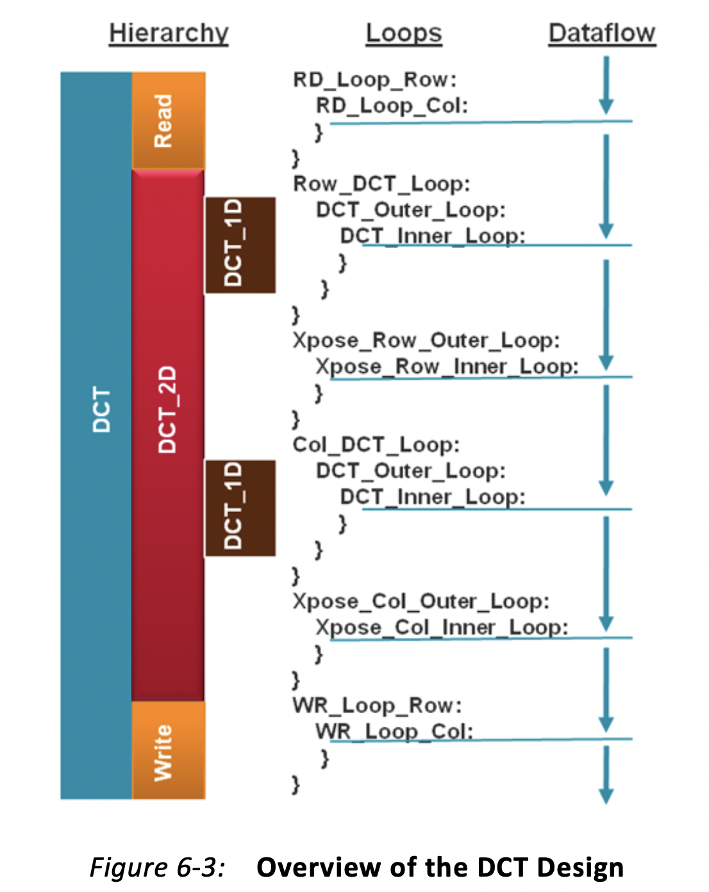
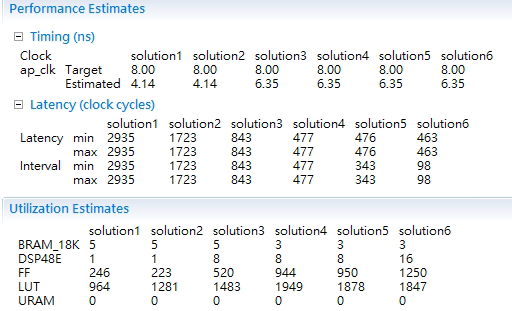

# DCT_HLS_Optimization

# Lab A - 2 (Design Analysis)
### brief description of  the function

We design a DCT accelerator using Vivado HLS

### build flow
- Import src to Vivoda HLS
- Manually set pragma using directive view

### result

